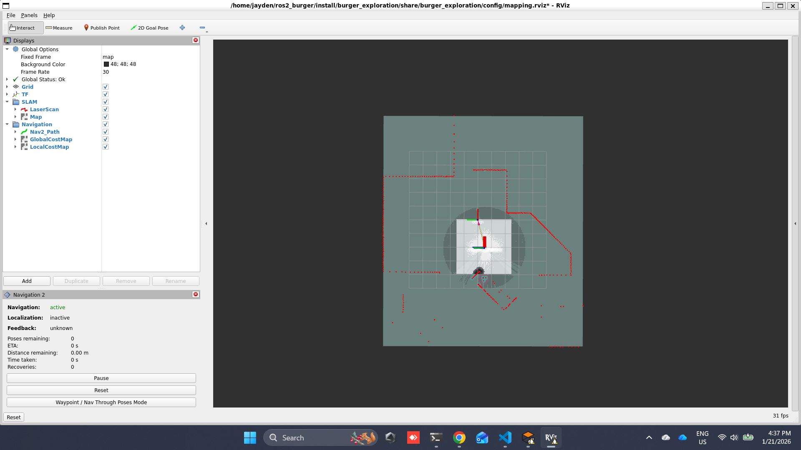
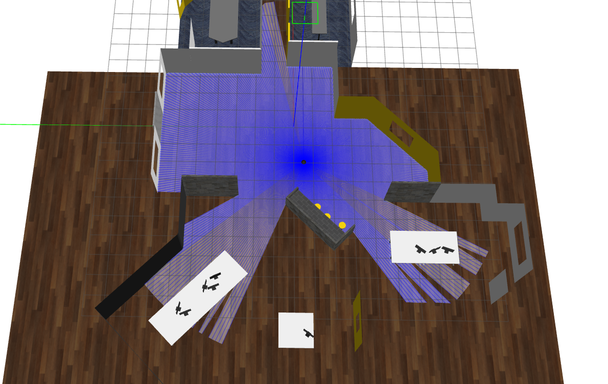
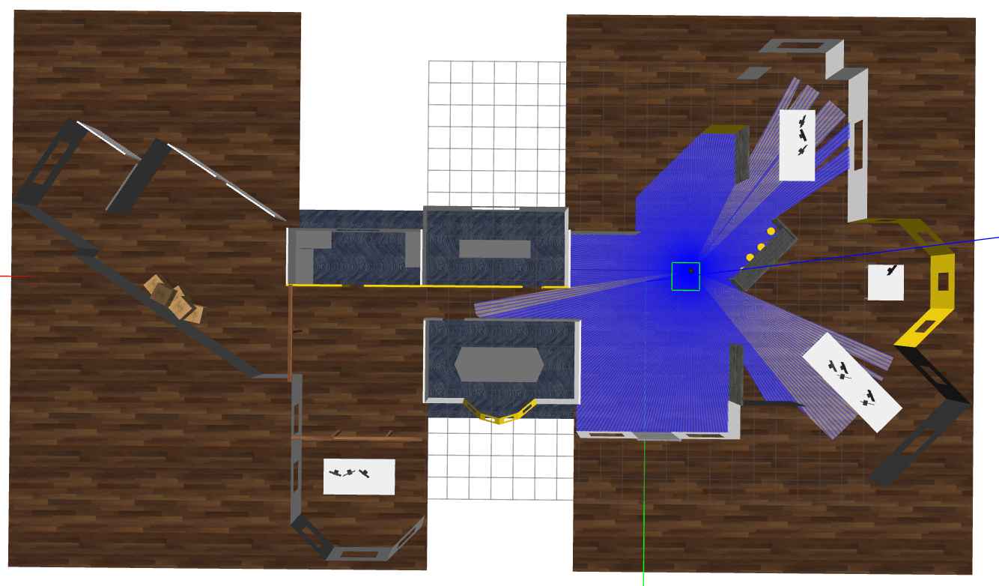
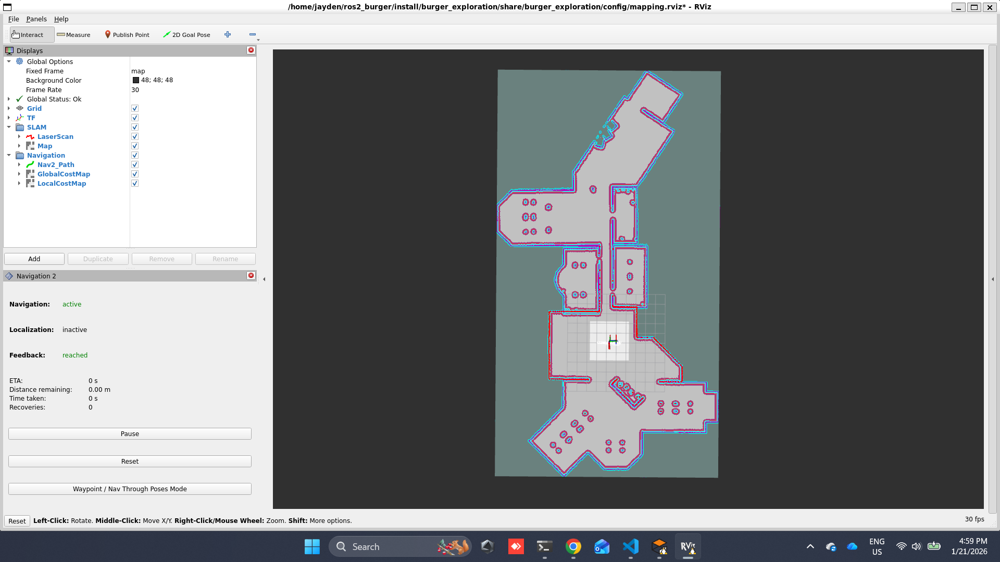
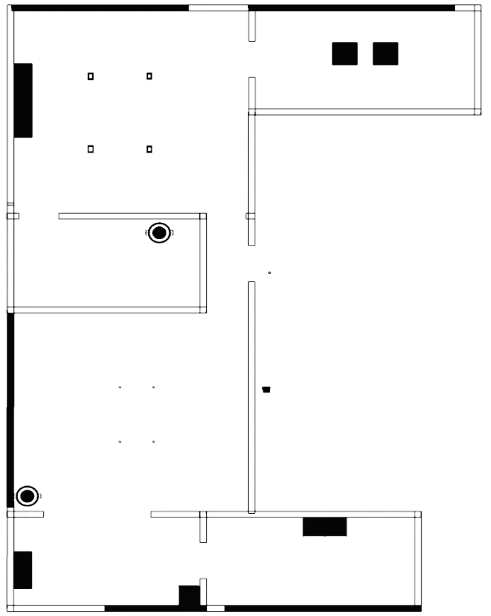
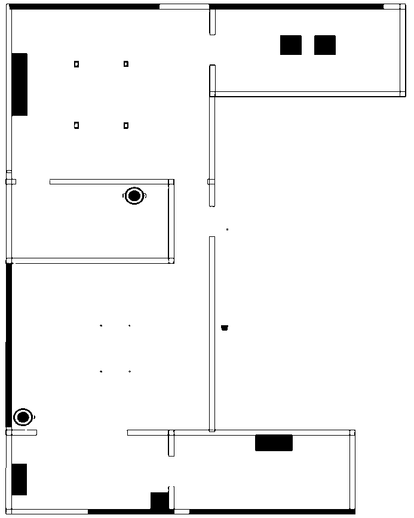
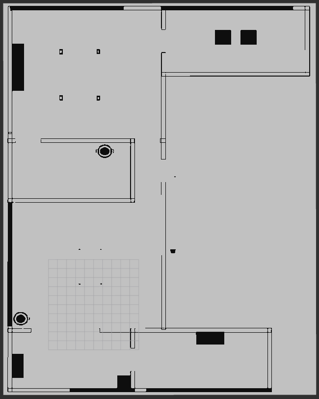
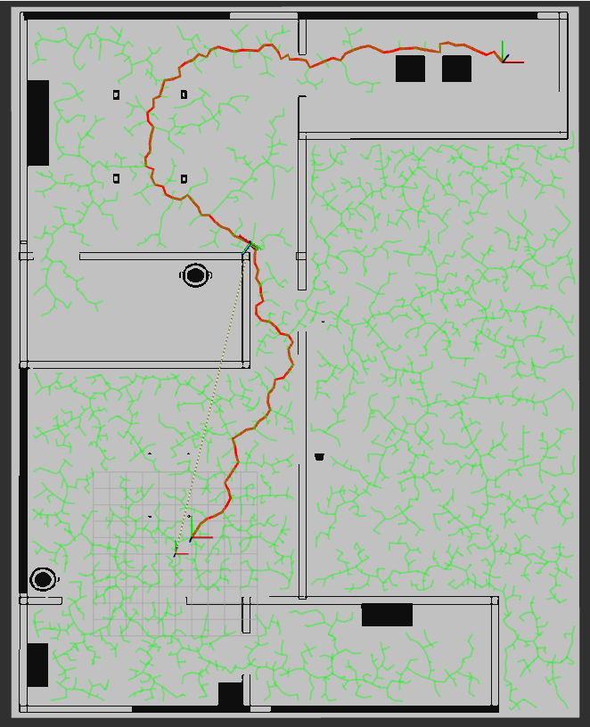

# Turtlebot3 Autonomy Assignment (ROS 2 Humble)

## Table of Contents

- [Overview](#overview)
- [Target Platform](#target-platform)
- [Quick Installation and Setup](#quick-installation-and-setup)
- [Task 1: SLAM and Exploration](#task-1-slam-and-exploration)
- [Task 2: Agentic Semantic Reasoning](#task-2-agentic-semantic-reasoning)
- [Task 3: RRT Path Planner](#task-3-rrt-path-planner)

---

## Overview

This project implements autonomous exploration, SLAM, semantic reasoning and custom RRT path planning for Turtlebot3 Burger on ROS 2 Humble.

**Completed Tasks:**
- ✅ **Task 1:** Autonomous exploration with SLAM and obstacle avoidance
- ✅ **Task 2:** Agentic semantic reasoning with MockVLM, deduplication, and semantic queries with navigation
- ✅ **Task 3:** Custom RRT path planner with robot size consideration

---

## Target Platform

- **ROS:** ROS 2 Humble 
- **Robot:** Turtlebot3 Burger 

---

## Quick Installation and Setup

```bash
sudo apt update
sudo apt install -y \
  ros-humble-xacro \
  ros-humble-tf2-ros \
  ros-humble-tf2-geometry-msgs \
  ros-humble-turtlebot3* \
  ros-humble-gazebo-ros-pkgs \
  ros-humble-slam-toolbox \
  ros-humble-navigation2 \
  ros-humble-nav2-bringup \
  ros-humble-nav2-map-server \
  ros-humble-nav2-lifecycle-manager \
  ros-humble-twist-mux \
  ros-humble-teleop-twist-keyboard \
  ros-humble-cv-bridge \
  ros-humble-image-transport \
  nlohmann-json3-dev \
  imagemagick \
```

```bash
source /opt/ros/humble/setup.bash
echo "export GAZEBO_MODEL_PATH=~/your_ws/src/burger_exploration/models/" >> /root/.bashrc
```

There are total 3 packages, all packages must be installed as the turtlebot3 simulation depends on the first package: **burger_exploration**
```bash
cd ~/your_ws/src
git clone https://github.com/Ja-cfzy/Turtlebot3-Autonomy-Assignment.git
cd ~/your_ws
colcon build --symlink-install --packages-select burger_exploration rrt_planner semantic_reasoning
source install/setup.bash
```

---

## Task 1: SLAM and Exploration

### Overview
Autonomous exploration using SLAM and Nav2 to build a map of an unknown office environment while avoiding obstacles. All the files are in burger_exploration

### Launch
```bash
# Terminal 1: Start Gazebo wth office world + Turtlebot3 + Rviz
ros2 launch burger_exploration run_burger_sim.launch.py

# Terminal 2: Start SLAM
ros2 launch burger_exploration online_async_launch.py

# Terminal 3: Navigation
ros2 launch burger_exploration navigation_launch.py
```

### Saving Map
```bash
# After exploration is complete
cd ~/your_ws/src/burger_exploration/map

# Save map
ros2 run nav2_map_server map_saver_cli -f office_map

# This creates:
# - office_map.pgm  
# - office_map.yaml 
```

### Deliverables
✅ **Launch files:**  
- online_async_launch.py - SLAM with slam_toolbox
- navigation_launch.py - Navigation with Nav2

✅ **RViz configuration:**  
- mapping.rviz  
- Shows: 2D mapping, robot pose, laser scan, navigation path, costmap  
  

✅ **Simulattion in Gazebo:**  
- Turtlebot3-Burger  
  
- Office Environment  
  

✅ **Saved map:**  
- Saved office map (.pgm + .yaml)  
  

✅ **Video Demonstration:**  
- Robot exploring and avoiding obstacles  
https://drive.google.com/file/d/1uT71EHzKM5CSzihXatXrlJ96A4NQcql6/view?usp=sharing  
 
---

## Task 2: Agentic Semantic Reasoning

### Overview
Semantic reasoning system enabling the robot to:
- **Detect** locations using position-based VLM: MockVLM (8 mock locations)
- **Merge** multiple observations of same location (intelligent deduplication)
- **Store** detection history (all images + timestamps per location)
- **Query** locations with natural language ("Where is the meeting room?")
- **Navigate** autonomously to semantic locations

Data Flow:
```
Camera Image + Robot Pose → MockVLM Classification → Deduplication
→ Real-time Detection List → Periodic JSON Save → Semantic Queries → Navigation
```

### System Design
**Location Structure** (Unified for Runtime & Database):
- `id`: >=0 
- `label`: "meeting room", "pantry", etc.
- `pose`: Position + orientation (for navigation)
- `confidence`: 0.5-1.0 based on distance to mock location
- `synonyms`: Alternative names ["conference room", "meeting area"]
- `detection_count`: Number of times detected
- `image_paths[]`: ALL images from detection history
- `timestamps[]`: ALL timestamps from detection history

**Mock Locations** (8 Total):
- 2x Meeting rooms (6.5, 3.5), (6.5, -1.5)
- 1x Pantry (-4.0, -2.0)
- 1x Entrance (3.0, 1.0)
- 3x Offices (-8.0, 1.0), (-6.0, -6.0), (13.0, 7.0)
- 1x Store room (20.0, -1.0)

**Semantic Label Generation** (MockVLM):
1. Robot captures camera image at position (x, y)
2. VLM checks distance to each of 8 mock locations
3. If within 1.5m radius: Classify as that location
4. Confidence = `1.0 - (distance / 1.5m)` clamped to [0.5, 1.0]
5. Return: label, confidence, synonyms

**Deduplication Algorithm**:
1. Check if new detection within `dedup_distance_` (2.0m default) of existing location
2. If match found AND same label:
   - Merge position: Weighted average using confidence scores
   - Append image paths and timestamps to history vectors
   - Increment `detection_count`
3. If no match: Add as new location

**Persistent Storage** (JSON):
```json
{
  "locations": [
    {
      "id": 0, "label": "meeting room", "detection_count": 3,
      "position": {"x": 6.5, "y": 3.5, "z": 0.0},
      "orientation": {"x": 0.0, "y": 0.0, "z": 0.0, "w": 1.0},
      "confidence": 0.95,
      "image_paths": ["captures/img_0.jpg", "captures/img_5.jpg", "captures/img_10.jpg"],
      "timestamps": ["1234567.123", "1234580.456", "1234593.789"],
      "synonyms": ["conference room", "meeting area"]
    }
  ]
}
```

**Query Processing** (queryByLabel):
1. User asks: "Where is the conference room?"
2. Extract keyword:"conference room" from natural language with 15 NLP patterns
3. Fuzzy match against all location labels + synonyms (threshold: 0.6) from latest JSON
4. "conference room" matches "meeting room" synonym
5. Return matched location with pose + confidence
6. Auto-navigate if enabled

### Launch
Delete the captures folder and JSON file on **semantic_reasoning** package before running the code
```bash
# Terminal 1: Start Gazebo with office world + Turtlebot3 with camera + Rviz
ros2 launch burger_exploration run_burger_camera_sim.launch.py

# Terminal 2: Start SLAM
ros2 launch burger_exploration online_async_launch.py

# Terminal 3: Navigation
ros2 launch burger_exploration navigation_launch.py

# Terminal 4: Semantic Reasoning
ros2 launch semantic_reasoning semantic_mapping.launch.py
```

```bash
# Terminal 5: Semantic Query Service
ros2 service call /semantic_query semantic_reasoning/srv/SemanticQuery \
  "{query: }"

# Example
ros2 service call /semantic_query semantic_reasoning/srv/SemanticQuery \
  "{query: 'Where is the meeting area?'}"

ros2 service call /semantic_query semantic_reasoning/srv/SemanticQuery \
  "{query: 'Show me the conference room'}"

ros2 service call /semantic_query semantic_reasoning/srv/SemanticQuery \
  "{query: 'Navigate to lobby'}"

ros2 service call /semantic_query semantic_reasoning/srv/SemanticQuery \
  "{query: 'Location of store room'}"
```

**Response example:**
```
response:
  found: true
  label: "meeting room"
  pose:
    position: {x: 6.5, y: 3.5, z: 0.0}
    orientation: {x: 0.0, y: 0.0, z: 0.0, w: 1.0}
  confidence: 0.95
```

### Deliverables
✅ **Core Features:**
- Position-based VLM with 8 mock locations
- Intelligent deduplication with pose merging
- Full detection history (images + timestamps)
- Periodic JSON persistence
- Real-time RViz visualization
- Query processing with auto navigation

✅ **ROS 2 Nodes:**
- semantic_mapper_node.cpp: Image capture, VLM classification, deduplication
- query_handler_node.cpp: Natural language query service, Nav2 integration

✅ **Images captured and JSON.file**
- captures: folder that contains all captured images
- semantic_map.json: JSON file that store all the detected location and data

✅ **Video Demonstration:**
- real-time image-to-label-tagging  
https://drive.google.com/file/d/1iWYlhlvC3bwxKLxJwJD0WJ7FkJnkMaO_/view?usp=drive_link  
- test case of semantic query  
https://drive.google.com/file/d/1SIwYbPt0uK96lQyRXj6QGKlvOLJbVcpW/view?usp=drive_link  

### Parameters Explained
| Parameter | Default | Description |
|-----------|---------|-------------|
| `map_frame` | "map" | Reference frame for poses |
| `base_frame` | "base_footprint" | Robot frame |
| `camera_topic` | "/camera/image_raw" | Camera image topic |
| `capture_interval` | 3.0s | Interval between capture |
| `min_distance_between_captures` | 2.0m | Minimum movement before capture |
| `deduplication_distance` | 2.0m | Distance threshold for location deduplication |
| `camera_offset_x` | 0.5m | Image position relative to base |
| `save_images` | true | Save captured images |
| `save_images_path` | "captures/" | Image save relative directory path |
| `json_file_path` | "semantic_map.json" | Database relative file path |
| `auto_navigate` | true | Auto-navigate after query |
| `similarity_threshold` | 0.6 | Similarity threshold for querying locations |

### Real VLM Integration (CLIP)
**Current Implementation:** Position-based MockVLM (8 predefined locations)  

**Real Implementation with CLIP:**
```cpp
// In mock_vlm.cpp, replace classifyLocation():
VLMResult classifyLocation(const cv::Mat& image, const geometry_msgs::msg::Pose& pose) {
    // 1. Preprocess image (resize to 224x224, normalize)
    cv::Mat img_resized;
    cv::resize(image, img_resized, cv::Size(224, 224));
    
    // 2. Call CLIP model with image
    // Option A: Local CLIP model (slower, no internet needed)
    auto embeddings = clipModel.encode_image(img_resized);
    
    // Option B: Cloud API (faster, requires internet)
    // auto embeddings = clipAPI.encode(image); // e.g., OpenAI CLIP
    
    // 3. Define semantic labels (context-specific)
    std::vector<std::string> labels = {
        "meeting room with conference table",
        "office workspace with desks", 
        "kitchen or pantry area",
        "entrance or lobby",
        "storage or supply room",
        "hallway or corridor"
    };
    
    // 4. Encode text labels
    auto text_embeddings = clipModel.encode_text(labels);
    
    // 5. Compute similarity scores (cosine similarity)
    auto similarities = cosine_similarity(embeddings, text_embeddings);
    
    // 6. Find top match
    int best_idx = argmax(similarities);
    double confidence = similarities[best_idx];  // 0.0-1.0
    
    return {
        label: labels[best_idx],
        confidence: confidence,
        synonyms: {/* generate from label */}
    };
}
```

**Integration Steps:**
1. Install CLIP
2. Replace MockVLM::classifyLocation() with real CLIP call
3. Keep deduplication & persistence unchanged (architecture-agnostic)
4. Monitor GPU usage (CLIP requires CUDA/GPU for speed)

**Advantages:**
- Works with ANY indoor environment (no hard-coded locations)
- Learns semantic understanding from CLIP training data
- Handles novel room types not in mock locations
- Can use custom prompts per domain

---

## Task 3: RRT Path Planner

### Overview
Custom Rapidly-Exploring Random Tree (RRT) path planner that:
- Plans collision-free paths considering robot size
- Visualizes RRT tree exploration
- Executes paths in simulation

### Map Preparation
**Convert Floor Plan to Black/White**
```bash
# Convert to pure black/white (no grey)
cd ~/your_ws/src/rrt_planner/map
convert map.png -colorspace Gray -threshold 70% -type bilevel map_bw.png

# Adjust threshold if needed:
# - Lower (30%) = thinner walls
# - Higher (70%) = thicker walls
```

**Create Map YAML**
```
image: map_bw.png
resolution: 0.05
origin: [-10.0, -10.0, 0.0]
negate: 0
occupied_thresh: 0.65
free_thresh: 0.196
```

### Inputs to the RRT Planner Node
- Occupancy grid ( nav_msgs/OccupancyGrid )
- Start pose ( geometry_msgs/PoseStamped )
- Goal pose ( geometry_msgs/PoseStamped )

### Launch
```bash
# Terminal 1: Start Gazebo with empty world + Turtlebot3
ros2 launch rrt_planner run_burger_sim.launch.py

# Terminal 2: Start map server + RRT planner + Rviz
ros2 launch rrt_planner rrt.launch.py

# Terminal 3: Activate map server
ros2 topic pub /start_pose geometry_msgs/msg/PoseStamped "{
  header: {frame_id: 'map'},
  pose: {position: {x: 1.0, y: 1.0}, orientation: {w: 1.0}}
}" --once

ros2 topic pub /goal_pose geometry_msgs/msg/PoseStamped "{
  header: {frame_id: 'map'},
  pose: {position: {x: 20.0, y: 30.0}, orientation: {w: 1.0}}
}" --once
```

### Deliverables
✅ **RRT Node:**
- rrt_planner.cpp - RRT implementation with robot size consideration

✅ **Example floor plan:**  
- Original floor plan image (PNG):  
  
- Black and white image after converted (PNG):  
  

✅ **Generated occupancy grid:**  
- Converted to OccupancyGrid  
  
 
✅ **Path visualization:**  
- Green: RRT tree exploration | Red: Final planned path  
  

✅ **Video demonstration:**  
- Robot following the planned path  
https://drive.google.com/file/d/1oZTBdjTzFS5VrnyBXwJT4NHeXJ8cnAf5/view?usp=drive_link  
 

### Parameters Explained
| Parameter | Default | Description |
|-----------|---------|-------------|
| `max_iterations` | 10000 | Max RRT iterations before giving up |
| `step_size` | 0.4 | Distance to extend tree (meters) |
| `goal_bias` | 0.1 | Probability to sample goal (10%) |
| `robot_radius` | 0.12 | Half of Turtlebot3 width + margin |
| `inflation_radius` | 0.15 | Additional safety buffer |
| `auto_execute` | true | Automatically follow path after planning |

---

**Last Updated:** January 2025
**ROS Version:** Humble

**Tested On:** Ubuntu 22.04 LTS

